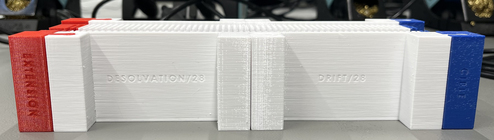

# CAD design files

## Description

This folder contains all CAD design files for the V2 3D printed version of the IMS. This version is designed to hold the electrodes together in place with the divider PCBs, the target and an extension to choose the number of electrodes wanted (28 or 29 per region). 

It is designed to be modulary and partially modified if necessary without needing to redo and reprint the whole device.

## Specifications

The desolvation and drift regions can hold 28 electrodes each, with the extension capable of putting 2 more electrodes in the front of the IMS.  
Every 2 electrodes have the same distance in between them, i.e. 0.8 mm. This ensures that the electric field is linear and continuous throughout the whole device.

The ESI needle (needs to be 3-4 kV higher in potential than the first electrode) can be mounted in front of the desolvation region.

A Nafion membrane is commonly used in IMS to separate ionized gases from other gaseous species and prevent measurement disturbances. Here are a few reasons why this membrane is used:
1. Ion selection: the Nafion membrane is selective for H+, Na+, K+ and NH4+ cation ions. It therefore selects the ions of interest for measurement, while rejecting other non-ionized or uncharged gaseous species.
2. Gas separation: the Nafion membrane is permeable to gases, but only allows high-mobility gases such as H2, N2, O2 and H2O to pass through. It therefore prevents low-mobility gases, such as noble gases, from entering the measurement zone and interfering with the results.
3. Impurity removal: the Nafion membrane can remove impurities from gases by exchanging the cations present on its surface with the impurities. It is therefore useful for eliminating contaminants that could interfere with measurement.

In our case, the membrane is mainly used for ion selection. In fact, it allows us to have only the species of interest in our spectrometer, and therefore more reliable results. The membrane is placed between the needle and the first electrode. 

Our membrane specifications:  
*Model: Nafion 117*  
*Thickness: 183 µm*  
*Density: 360 g/m2*  
*Conductivity: 0.083 S/cm*  
*Exchange capacity: 0.89 meq/g*  
*Size: 40 mm diameter circle*  

## Current limitations

1. There currently lacks a way to implement a 3 grid shutter in this version of the IMS. There needs to be an access point for the middle of the IMS, in between the 2 regions where we can insert the 3 grids and let the ion packets pass on command.

2. The target may need an accomodation on its back to solder the amplification PCB in order to connect them together and have the shortest path possible (thus reducing noise and unwanted disturbance on the output signal).

## Target/Cible

The target ("Cible") is mounted at the end of the IMS, and has room on its back side to connect the amplification PCB.

## CAD designed device

Below is a picture of the CAD simulated IMS device.

  
   
  

And a picture of the CAD printed, with the 4 different parts assembled. 

    

## Mounted IMS

And here is a picture of the 3D printed IMS in its current state, with the electrodes, dividers and target (see "PCB" folder for specifications).

(picture to be taken)

