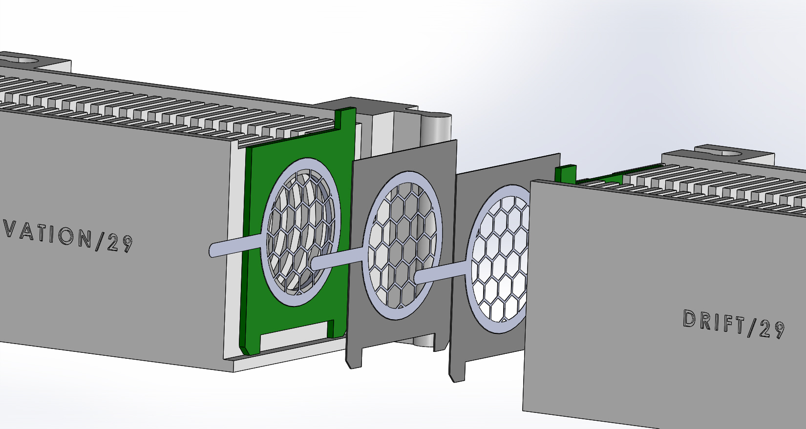
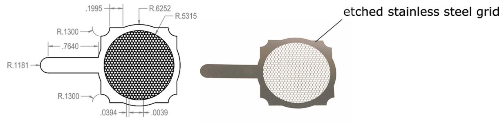
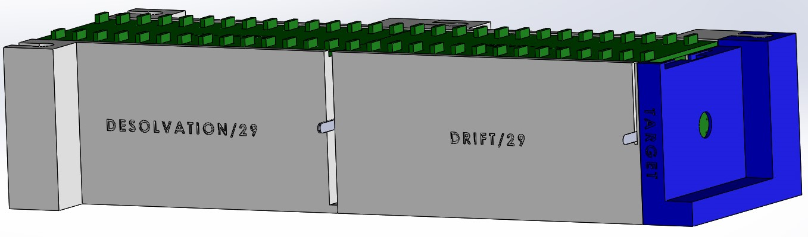
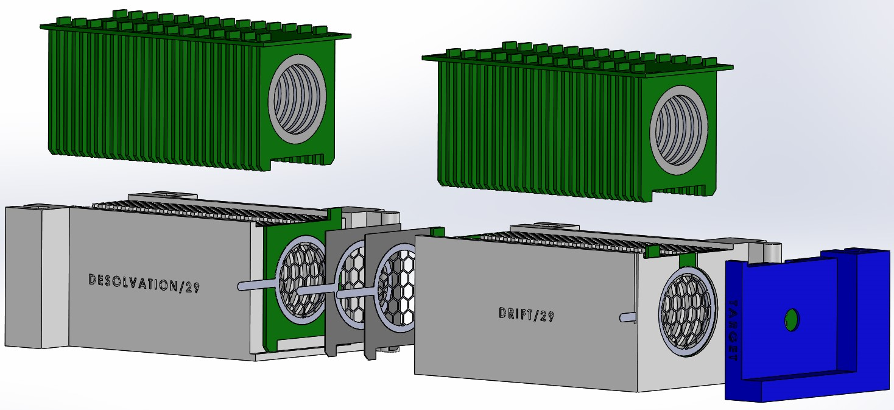

# CAD design files

## Description

This folder contains all CAD design files for the V3 3D printed version of the IMS. This version is designed to hold the electrodes together in place with the divider PCBs, the target and an extension to choose the number of electrodes wanted (29 per region). It's an upgraded version of V2, capable of accommodating the 3-grid ion shutter, the aperture grid and a chamber on the backside of the target for the inlet drift/carrier gas.

It is designed to be modulary and partially modified if necessary without needing to redo and reprint the whole device.

- All the files are in 3 different versions : 
1. .SLDPRT, aka Solidworks (software used initially)
2. .STEP, to be able to open them in most CAD softwares
3. .3mf, the standard manufacturing file to 3D print with a FDM printer (e.g. prusa)

NB: The "Cible" (i.e. target) and electrode PCBs are the same one as in the V2 version, thus they are the same files as in the V2 folder. The divider PCB is different, because it is the 29 electrode slots version, as per the paper.

## Specifications

The desolvation and drift regions can hold 29 electrodes each.  
Every 2 electrodes have the same distance in between them, i.e. 0.8 mm. This ensures that the electric field is linear and continuous throughout the whole device.

The ESI needle (needs to be 3-4 kV higher in potential than the first electrode) can be mounted in front of the desolvation region.

A Nafion membrane is commonly used in IMS to separate ionized gases from other gaseous species and prevent measurement disturbances. Here are a few reasons why this membrane is used:
1. Ion selection: the Nafion membrane is selective for H+, Na+, K+ and NH4+ cation ions. It therefore selects the ions of interest for measurement, while rejecting other non-ionized or uncharged gaseous species.
2. Gas separation: the Nafion membrane is permeable to gases, but only allows high-mobility gases such as H2, N2, O2 and H2O to pass through. It therefore prevents low-mobility gases, such as noble gases, from entering the measurement zone and interfering with the results.
3. Impurity removal: the Nafion membrane can remove impurities from gases by exchanging the cations present on its surface with the impurities. It is therefore useful for eliminating contaminants that could interfere with measurement.

In our case, the membrane is mainly used for ion selection. In fact, it allows us to have only the species of interest in our spectrometer, and therefore more reliable results. The membrane is placed between the needle and the first electrode. 

Our membrane specifications:  
*Model: Nafion 117*  
*Thickness: 183 µm*  
*Density: 360 g/m2*  
*Conductivity: 0.083 S/cm*  
*Exchange capacity: 0.89 meq/g*  
*Size: 40 mm diameter circle*  

Below is a close up picture of the exploded 3-grid ion shutter :

  

## Current limitations

This version hasn't been printed because we do not have the grids nor the grid spacers yet. The spacers are supposed to be 0.3mm thick, made of basically any non conductive material, and the grids are 0.1mm thick, made of stainless steel (NB: the grids in the assembly have a coarser grid with a bigger honeycomb pattern to lighten the computationnal render).

  

## Target/Cible

The target ("Cible") is mounted at the end of the IMS, and has a hole on its back side to connect the amplification PCB as well as a hole on its top to put a tube inlet for the drift/carrier gas.

## CAD designed device

Below are pictures of the CAD simulated IMS device.

   

