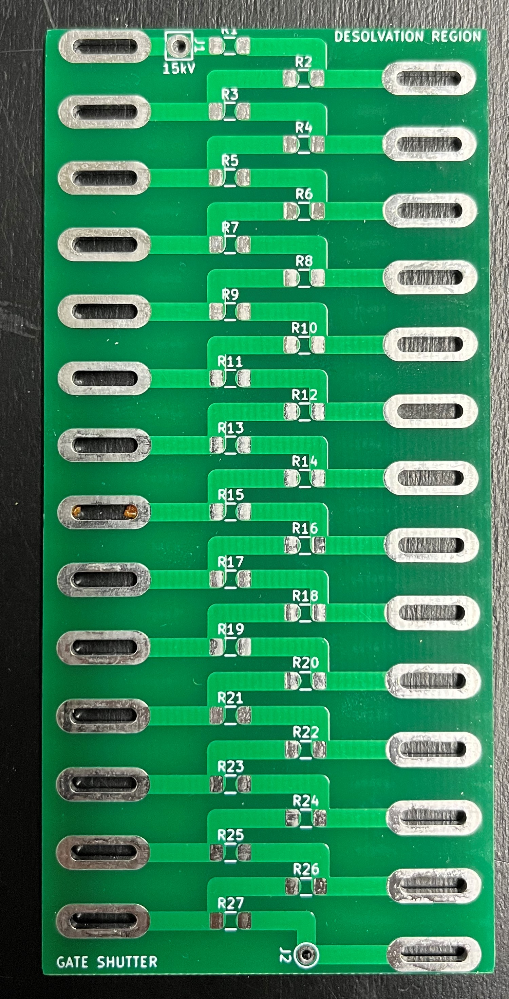
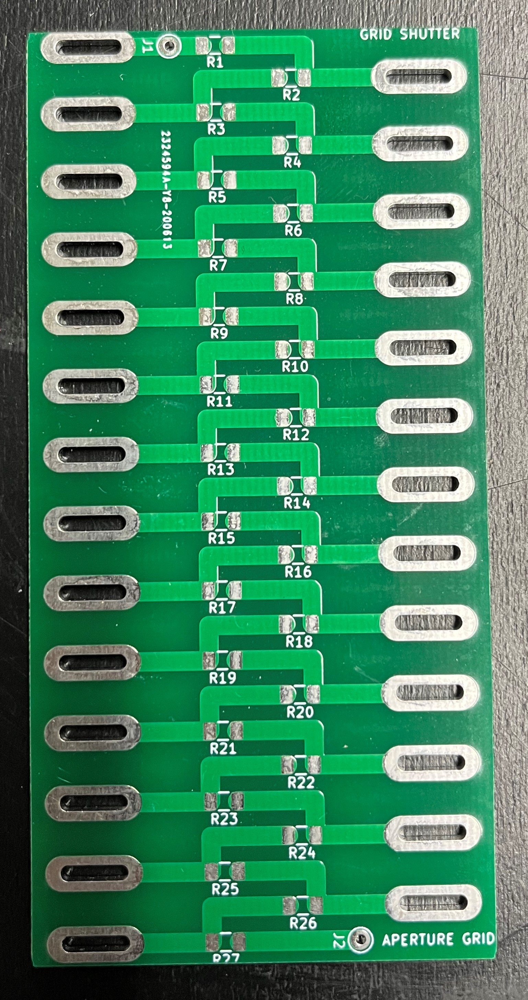

# Divider

## Description

Printed circuit board of the two voltage dividers for the desolvation region and the drift tube/region. Connects all electrodes together with 10 M $\Omega$ in between each of them, to create a continuous voltage gradient and thus an electric field to accelerate the ions. 

## Specifications and limitations

The highest voltage is 11.5 kV at the first electrode, down to the ground connected last electrode, and the target at the end of the drift tube.

Higher resistors in between the electrodes doesn't change the voltage gradient but reduces the current and thus the electrical consumption.

## PCB

Below are pictures of the PCBs. First one is desolvation region and second one is drift region.

    
    

