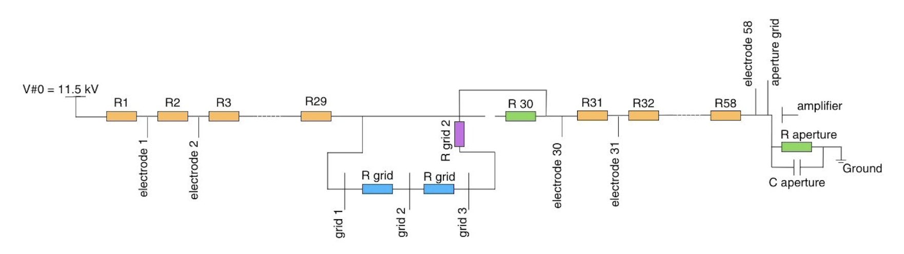

In order to better understand the overall electrical diagram and the paper’s resistance choice, an equivalent electrical diagram of the IMS from the first electrode to the amplifier is shown below. 

    

Thanks to those equations, we see that when the gate is closed, the potential of the second grid is higher than when it is opened. In the paper, they recommend adding 30 to 80 V (referenced to ”small” in the equations) to stop the flow of electrons. According to the calculations, a value of 50V or higher would result in a reverse electric field and effectively close the gate. 

These calculations are based on the paper’s values, not those of the current prototype. For the moment, the resistors on the divider PCB are 10 MΩ, designed to reduce power consumption. But this does not seem necessary, since with 1 MΩ resistors, power consumption is already only 160 to 200 μA, and changing the resistor of the dividers would also mean adapting the other resistors of the circuit.